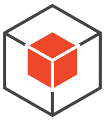
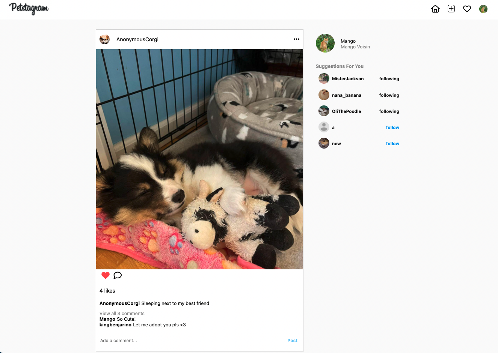
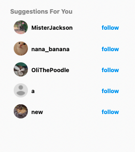
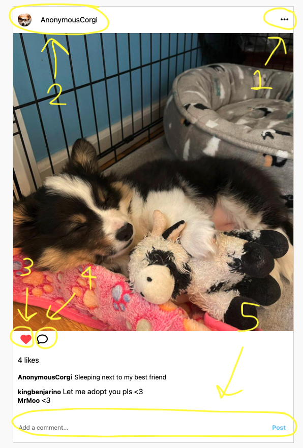
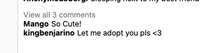
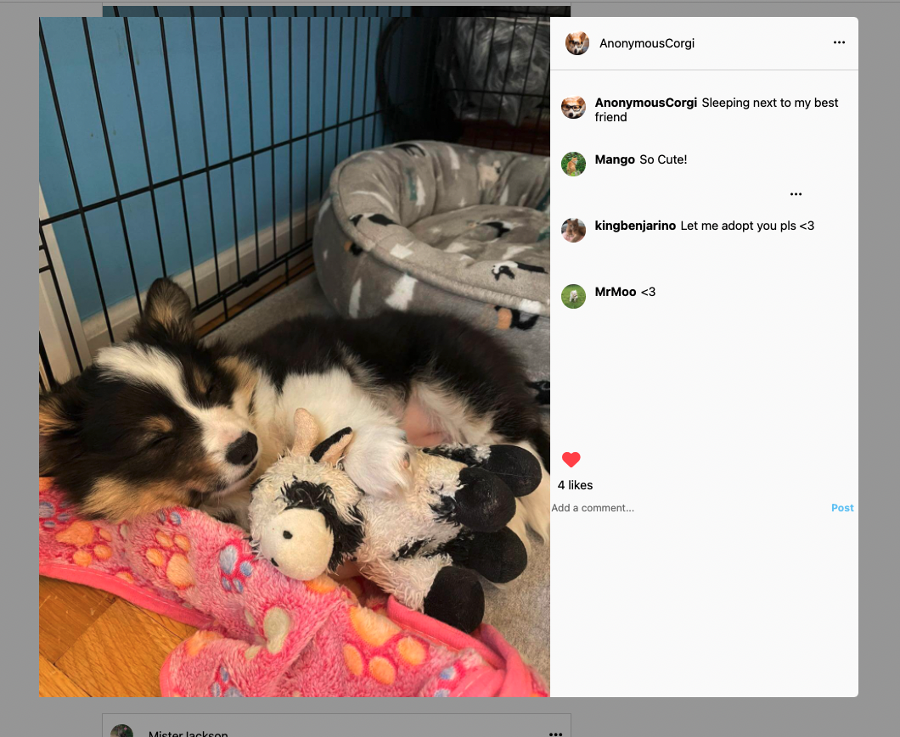

# Petstagram
Petstagram, a full-stack application inspired by Instagram, is a photo-sharing platform where pet owners can upload and share photos of their beloved pets with their friends and followers. Users can interact with posts shared by their friends by commenting, liking, and viewing them on their feed.

[Visit the site live here!](https://thepetstagram.herokuapp.com/)

* [MVP Feature List](https://github.com/jstnswn/Instagram-Clone/wiki/Feature-List)
* [User Stories](https://github.com/jstnswn/Instagram-Clone/wiki/User-Stories)
* [Database Schema](https://github.com/jstnswn/Instagram-Clone/wiki/Database-Schema)
* [Frontend Routes](https://github.com/jstnswn/Instagram-Clone/wiki/Frontend-Routes)
* [API Documentation](https://github.com/jstnswn/Instagram-Clone/wiki/API-Routes)

# Technologies Used

# Getting Started

1. Clone the repository

       git@github.com:jstnswn/Instagram-Clone.git

2. CD into the /app directory and install dependencies

        pipenv install

3. CD into the /react-app directory and install dependencies

        npm install

4. Create a .env file based on the example with proper settings for your development environment

5. Setup your PostgreSQL user, password and database and verify that it matches your .env file

6. Start your shell, migrate your database, seed your database, and run the flask app

        pipenv shell

        flask db upgrade

        flask seed all

        flask run

7. Create your AWS user and bucket:

      -Create a bucket:

        (https://s3.console.aws.amazon.com/s3/home?region=us-east-1)

      -Create a user with `programmatic access` by navigating to:

        (https://console.aws.amazon.com/iam/home?#/users)

      -Set up a security policy for your user: 'Attach existing policies directly' => 'Create Policy'

      -Click the `JSON tab` and set a policy:

          {
           "Version": "2012-10-17",
           "Statement": [
             {
               "Sid": "Stmt1420751757000",
               "Effect": "Allow",
               "Action": ["s3:*"],
               "Resource": "arn:aws:s3:::<NAME OF BUCKET>/*"
             }
           ]
          }

      -Now update your .env with your `S3_BUCKET`, `S3_KEY`, `S3_SECRET`

8. Open another terminal and change directory into /react-app and run the React app

          npm start

# Features

## Splash Page
Users can log in with an existing account or sign up and create a new account. There is also a demo option so users can quickly explore the site.

</img>
 - Login/Signup form placeholders shift when filling out the form.
 - Submit button doesn't allow you to click if the form isn't complete
 - Error handling for invalid email or password.

</img>
## Dashboard

Once logged in, the dashboard presents the user with a feed of posts shared by those they follow. The user is then able to infinitely scroll down his feed and click on a post they would like to interact with. There is also a nav bar at the top of the dashboard that coveniently allows the user to create a post, go to their profile page, or log out.

- When logging in you will be greeted with dashboard feed that is filled with post from users that you are following.
- This feed will infinitely scroll until you run out of posts.

</img>

- If you aren't following anyone your dashboard will be empty but you will see a list of suggested people to follow

</img>

- On each dashboard post you can:
  1. Click the ellipsis to open a modal that has an unfollow option.
  2. Click on the owner of the post to visit their profile.
  3. Click on the heart to like a post which dynamically changes the color aswell as the like count.
  4. Click the comment bubble to view all comments.
  5. The user can add a comment to the post which updates dynamically. When there are more than 2 comments the rest are hidden.

</img> </img>

- When you click on the comment bubble or 'View all comments' it opens the postView modal where you can see all comments
- Here you can also leave a comment or like a post.
-
</img>
## Images

Clicking on the upload icon in the nav bar will open up a modal form, where the user is able to create a new post with an image of their favorite pet and caption.

Once a post is created, the user can both edit and delete their post.

## Comments

Upon clicking on a post, the user is able to read/write comments as well as delete/edit their own individual comment.

## Likes

A user is able to like/dislike any image in their feed, including their own.

## Follows

On the dashboard, a user is able to unfollow any users they are currently following. On any profile page, the logged in user can click and view a list of followers/following specific to the profile page user. There, the logged in user has the option to follow or unfollow anyone on that list.
